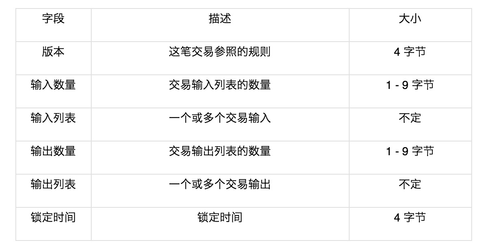
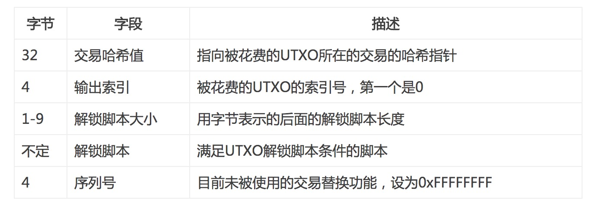
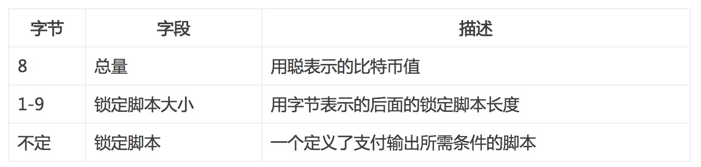

<h2>比特币浅见之区块结构  1</h2>

> 写作本文主要是为强化自己的理解，增强记忆，内容全部来自阅读以下网址文章理解，无任何原创内容，理解可能有误，况未看实际代码验证正确性，若有错误之处请指正。
> 1. [《深入区块链原理》系列连载](https://bbs.huaweicloud.com/blogs/405becb21d1c11e89fc57ca23e93a89f "《深入区块链原理》系列连载")
> 2. [比特币脚本及交易分析 - 智能合约雏形](https://learnblockchain.cn/2017/11/10/bitcoin-script/)

### 概述
比特币的区块可分为区块头和区块体，区块头主要记录该区块的关键字段信息，而区块体存储放置在该区块中的交易信息。除第一个区块外的任一区块通过记录上一区块的`hash`值，与上一区块关联，像一条`只能`从后到前的单向通道一样，当然也可以形容成一根链条，故称为区块链(Block Chain)。

### 区块(Block)
| size | field | description |
| ------ | ------ | ------ |
| 4 bytes | Block Size | 区块大小，单位bytes |
|80 bytes	|Block      Header	|区块头信息|
|1–9 bytes (VarInt)|	Transaction|   Counter	区块中交易的数量|
|Variable|	Transactions|区块中所有交易记录的数据 |

> 疑问：字段Transaction作者解释为`区块中所有交易记录的数据`，但交易数据不是都记录在区块体中吗？

### 区块头(Block Header)
|Size |Field|Description |
| ------ | ------ | ------ |
|4 |bytes	Version	|区块版本号，目前为2|
|32 bytes|	Previous     、  Block Hash|	前置区块（父区块）的区块头Hash，Hash算法为double-SHA256|
|32 bytes	|Merkle      Root	|区块中交易Merkle树根|
|4 bytes	|Timestamp	|区块创建UNIX时间戳|
|4 bytes	|Difficulty      Target	|工作量证明算法难度|
|4 bytes	|Nonce	|通过变动该计数器来达成工作量证明要求的结果|

区块头与区块体通过字段`Merkle Root`联系在一起，它是由该块的交易数据数据生成的`Merkle Tree`的根节点。构造过程如下图所示：

> Merkle Tree优点
> 1. 对于那些存储空间有限的设备(也称为节点)，可以不用存储完整的区块链(区块头+区块体)，只需要存储区块头，就可以验证一笔交易是否存在，以上图为例，要验证交易TxA是否存在，节点只需要向那些存储完整区块链的节点发送请求，返回的请求中有<code>HB，HCD</code>, 然后将计算出的根节点Hash与该块中记录的根节点Hash比较，如果相同，则该笔交易存在，否则不存在。
> 2. 防篡改，由Merkle Tree的生成过程可以发现，如果tree中任何交易数据被更改，都会造成根节点值的改变，从而知道该块中的交易数据被改过。

> + 全节点：存储完整区块链的节点
> + 轻节点：只存储区块链的区块头的节点

### 区块体(Block Body)
区块体中存放打包在该区块中的交易信息，每笔交易的存放信息如下表所示:

> 交易的锁定时间定义了能被加到区块链里的最早的交易时间。在大多数交易里，它被设置成0，用来表示立即执行。
如果锁定时间不是0并且小于5亿，就被视为区块高度，意指在这个指定的区块高度之前，该交易不会被包含在区块链里。
如果锁定时间大于5亿，则它被当作是一个Unix纪元时间戳（从1970年1月1日以来的秒数），并且在这个指定时间之前，该交易不会被包含在区块链里。

交易的数据结构没有交易费的字段，交易费通过所有输入的总和，以及所有输出的总和之间的差来表示，即：
> 交易费 = 求和（所有输入） - 求和（所有输出）

交易输入结构如下表所示：

> 无论是解锁脚本(Signature script), 还是锁定脚本（PubKey script)，其实就是段能够在比特币软件下执行的代码

> 疑问：交易哈希值如何计算出来的？

交易输出结构如下表所示：

> 疑问：为什么交易输出只要一个锁定脚本即可？