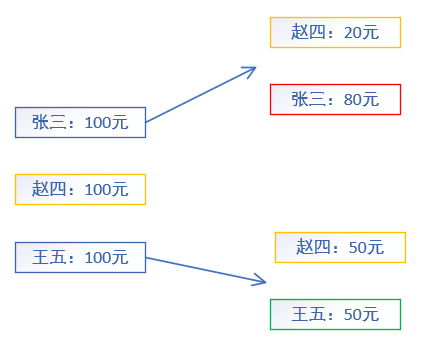

<h2>比特币浅见之比特币如何工作  2</h2>

> 建议直接看引用的链接。写作本文主要是为强化自己的理解，增强记忆，内容全部来自阅读以下网址文章理解，无任何原创内容，理解可能有误，况未看实际代码验证正确性，若有错误之处请指正。
> 1. [《深入区块链原理》系列连载](https://bbs.huaweicloud.com/blogs/405becb21d1c11e89fc57ca23e93a89f "《深入区块链原理》系列连载")
> 2. [比特币脚本及交易分析 - 智能合约雏形](https://learnblockchain.cn/2017/11/10/bitcoin-script/)
> 3. [比特币客户端的 Coin Select 策略](https://zhuanlan.zhihu.com/p/36030990)
> 4. [比特币 区块链 几种交易标准详解 P2PKH、P2PK、MS、P2SH加密方式](https://blog.csdn.net/jerry81333/article/details/56824166)

### 概述
最近看了些关于比特币的文章，自以为对比特币如何工作了解的差不多了，和朋友聊起比特币，他提了几个基本的问题，尽管部分问题有些解答思路，但让我表述出来，还是觉得十分困难，这说明自己对比特币如何工作并不清楚。这个事情也提醒了我，但看还不行，还得带着问题去看，强迫自己去思考，这样才能看懂，正如“学而不思则惘，思而不学则怠”。

### 问题
1. [比特币的交易模型是什么？为什么选择用这种交易模型？](#utxo)

1. [比特币选择UTXO花费的策略？例如：A用户有100元，有4个大小分别为10元的UTXO，40元的UTXO，20元的UTXO，30元的UTXO构成，现A要向B转35元，A会选择那些UTXO去支付？](#utxostrategy)

1. [什么是比特币的交易地址？](#transactionaddress)

1. [比特币中有哪些交易类型？](#transactiontype)

1. [一笔交易从产生到完成的过程？](#producttransaction)

1. [如何生成一个区块？](#productblock)

1. [比特币是如何挖矿的？](#mining)

1. [比特币如何处理分叉？](#bifurcation)

1. [什么是软分叉和硬分叉](#softbifurcation)

1. [比特币网络节点分哪几类？](#nodetype)

1. 在比特币中，如何衡量一个节点与另一个节点的距离？节点如何选择与其最近的节点？

1. 从网络原理角度看，比特币网络的p2p可以如何实现？

1. 可以用比特币网络帮你记录信息吗？如果可以，该怎么做？

1. [维持比特币网络浪费资源吗？](#wastresource)

1. [比特币安全吗？](#safe)

1. [什么是共识机制? 为什么说比特币是去中心化的？](#consensus)

1. [比特币对人类的意义？](#humanmean)

### 解答
> 比特币的交易模型是什么？为什么选择用这种交易模型？

比特币的交易模型全称是Unspend Transcation Output(简称UTXO)，通常我们所见的模型是银行所用的账户模型，即一个账户可以看做一段记录，里面记录着该账户的所属人，余额等信息，若A用户向B用户转100元，如果A用户余额不小于100,并且该笔转账合法，则A的余额会减100，而B的余额加100，很好理解。UTXO模型与账户模型的转账过程有很大不同。下面举例说明。

如上图所示，初始时张三，赵四和王五各100元，然后张三向赵四转了20元，这笔交易有一个输入【张三：100】，产生两个输出【赵四：20】，【张三：80元】，王五向赵四转了50元，这笔交易有一个输入【王五：100】，产生两个输出【赵四：50元】，【张三：50元】，上面两次交易产生的就是输出就是UTXO，在一笔交易后，输入的UTXO作废（被消费了），产生的新的UTXO可以继续使用。那如何统计某个用户的可用余额呢？就是其所有未消费的UTXO的总和。从整个过程可以知道，在UTXO模型下的所有用户，无论他们之前怎么做多少次交易，该模型下所有未花费的UTXO的和是恒定的。`至于为什么采用比特币采用UTXO模型，而不用账户模型，这点我还不知道`。

> 比特币选择UTXO花费的策略？例如：A用户有100元，有4个大小分别为10元的UTXO，40元的UTXO，20元的UTXO，30元的UTXO构成，现A要向B转35元，A会选择那些UTXO去支付？

UTXO选择策略希望达到的目标，第一是挑选出来的UTXO之和大于或等于要花费的数量+交易费，第二选择尽可能少量的UTXO，以使内存中的UTXO set尽可能少。在Bit core软件中使用了如下策略：
1. 如果钱包中有UTXO等于目标金额，则选择该UTXO，否则，执行下一步
2. 如果所有比目标金额少的UTXO之和刚好等于目标金额，这选择这些UTXO，否则，执行下一步
3. 如果所有比目标金额少的UTXO之和还是比目标金额少，那么选择钱包里第一个超过目标金额的UTXO
`后面过程待定`

> 什么是比特币的交易地址？
与比特币交易地址相关的概念有随机数，密钥，公钥，SHA256，压缩公钥，对称加密，secp256k1椭圆曲线算法，RIPMED160，Base58check编码，WIF（Wallet Import Format，即Base58check格式）格式。大概过程是：
1. 生成随机数
2. 用SHA256将随机数生成转化为256位的密钥
3. 用secp256k1椭圆曲线算法获得密钥对应的公钥，其中公钥可以用压缩的方式存储，可以节约一半的存储空间
4. 对公钥依次做SHA256运算，RIPEMD160运算（上面两个算法合称为双哈希或HASH160，这就生成了公钥哈希
5. 然后使用Base58check编码对（版本前缀 + 公钥哈希 + SHA256（SHA256（版本前缀 + 公钥哈希））前4字节进行Base58编码），最终得到比特币地址。
个人理解：密钥有256位，保证了其取值空间相当相当大，很难发生碰撞，在知道对方的公钥情况下，猜出其私钥也几乎不可能。据说量子计算机可以在可接受的时间范围内破解secp256k1椭圆曲线算法，也就是当前密钥加密算法在量子计算机是不安全的，解决该问题，可以通过更新加密算法等其他方式以解决，更新加密方式也会遇到些问题，在此不做讨论。为什么不直接用公钥作为交易地址呢？前面说了，在量子计算机面前，暴露公钥是很不安全的，成员组了比特币地址来代替公钥，由于公钥生成比特币地址用的是非对称加密，知道了比特币地址，也不可能推出公钥，而做转出交易，需要用公钥解锁UTXO，导致公钥暴露在链中，因此只要该比特币地址未做转出交易，那么该地址对于的密钥可以说是绝对安全。为什么会有WIF（Wallet Import Format）即Base58check编码，我的理解是，哈希算法转换出来的全部是二进制，对于人类记忆及其不友好，然后通过Base58check编码，将二进制串编码成英文字母，便于记忆。注意密钥，公钥和地址三者是一对一关系。

> 比特币中有哪些交易类型？

谈到比特币的交易类型，就不得不说明其锁定脚本（lock script）与解锁脚本（unlocking script）。这里的脚本完全可以理解为编程中的代码，每笔UTXO与一串代码（lock script）绑定在一起，任何人要使用这个UTXO，就必须提供一串代码（unlock script），这两串代码合在一起，执行结果如果是true，则说明提供该代码的人有权使用该UTXO，否则不能。由上过程可以看出，与UTXO绑定的代码就像一个锁一样锁着UTXO，而要解锁就必须提供对于的钥匙，称这两串代码分别为锁定脚本（locking script）和解锁脚本（unlock script）。要执行脚本，就须有对于的语言（类似于C++，java等）和执行该脚本的机器（可以是实体机器，亦可以是一个软件，例如java虚拟机）。比特币故意使用了一种图灵非完备的语言，没有循环或复杂的流程控制，减少了灵活性，但极大的提供了安全性。比特币交易脚本是无状态的，所以一个脚本能在任何系统上以相同的方式执行。同时其实基于堆栈语言，极其简单，也增强了比特币的安全性。
* P2PKH(Pay-to-Public-Key-Hash)

解锁脚本：\<sign>\<PubKey>

锁定脚本：OP_DUP OP_HASH160 \<PubkeyHash> OP_EQUALVERIFY OP_CHECKSIG

首先将解锁脚本+锁定脚本合成一个脚本，将sign压入栈，PubKey压入栈，复制PubKey到栈顶，计算栈顶元素的HASH160，并移除栈顶元素，比较栈顶元素与PubkeyHash是否相同，如果相同，则通过栈顶的PubKey解密sign，等到交易的Hash，并比较与实际的哈希值是否一样，如果一样，则返回true。由脚本执行过程可知，该交易标准，当在转账时，收款人只需要提供比特币地址，在使用UTXO时，提供使用密钥生成的签名和公钥（公钥会暴露在去块中）

* P2PK(Pay-to-Public-Key)

解锁脚本：\<sign>

锁定脚本：\<PubKey> OP_CHECKSIG

首先将解锁脚本+锁定脚本合成一个脚本，sign压入栈，PubKey压入栈，用PubKey解密sign获得交易Hash，交易实际Hash比较，如果相同，返回true。由脚本执行过程可知，该交易方式，无论是转出还是转入，自己的公钥都会暴露在区块中，相对于P2PKH更不安全些，但是其优点在于解锁脚本和锁定脚本所需要的存储空间少了许多。

* MS（Multiple Signature）

以2-3多重加密为例：
解锁脚本：OP_0 \<Signature B> \<Signature C>

锁定脚本：2 \<Public Key A> \<Public Key B> <Public Key C> 3 OP_CHECKMULTISIG

通常称为M-N多重签名，M表示密钥个数，N表示公钥数，要解锁M-N多重签名脚本，必须提供至少包含M个签名的解锁脚本。与P2PK类似

* P2SH（Pay-to-Script-Hash）

以2-3的P2SH为例：
解锁脚本：\<Sig1> \<Sig2> <2 PK1 PK2 PK3 PK4 PK5 5 OP_CHECKMULTISIG>

锁定脚本：OP_HASH160 8ac1d7a2fa204a16dc984fa81cfdf86a2a4e1731 OP_EQUAL

该交易方式的锁定脚本与P2PKH锁定脚本类似，P2PKH锁定脚本使用的是一个公钥的SHA160串（P2PKH的比特币地址），而多重签名使用的是N个公钥形成的串的SHA160串作为地址。提供了一种，在不转出的情况下，其他人无法得知该地址的公钥，更加安全。同时，会增加存储空间。

* [隔离见证](https://bbs.huaweicloud.com/blogs/710256bf476611e89fc57ca23e93a89f)

> 一笔交易从产生到完成的过程？

交易数据结构：版本号，输入数量，输入列表，输出数量，输出列表，锁定时间
输入数据结构：包含要花费的UTXO的交易Hash，输出索引，解锁脚本大小，解锁脚本，序列号
输出数据结构：总数量，锁定脚本大小，锁定脚本
转出方打包好一个交易数据结构，然后将该数据向全网广播，全节点收到该交易后，会先验证该交易数据是否正确合法，如果不正确合法，则丢弃，否则向全网广播该交易，同时会将其放到机器的内存里面（也称为交易池），交易池中的交易会按照优先级由高到低排序，然后全节点会选择池中优先级排在前面的一定数量的交易，将他们打包在一个区块中。通常认为，从生成交易的区块开始，区块链又增加了至少4个区块（大概40分钟），则认为该交易已成功完成。

> 如何生成一个区块？

区块数据结构：区块大小，区块头，区块交易数量，区块中的所有交易数据

区块头：区块版本号，父区块Hash，该区块的交易Merkle树根，交易时间戳，工作量证明算法难度，Nonce

当前区块中放父区块Hash，这样就可以将整个比特币中的区块连接起来了，就像根链条一样。Merkle数的叶子节点指向对应的交易，由于Merkle树的特性，保证了每一笔交易的记录在块中后，不可更改，因为只有更改了，Merkle的树根就会变化。同时Merkle也为简化交易提供了解决方法。

每一个要生成区块的节点，尽力去解决当前的难度的问题，一旦获得合法解，则将生成的区块添加到区块链尾，并立即广播该区块，收到该区块的节点，首先验证该区块是否正确合法，如果不正确合法，则抛弃，否则将该区块添加到区块尾，并广播出去。这里会出现一种情况（称为区块分叉），那就是多个节点在相差时间很少的情况下都计算出了合法解，那么网络中就会出现，一部分节点的存放的区块链的尾节点与其他部分存放的区块链的尾节点不一致。

[深入比特币原理（十一）——工作量证明（Proof of Work）](https://bbs.huaweicloud.com/blogs/061e1096233a11e89fc57ca23e93a89f)

生成区块的难度并非在每次生成一个区块就调整一次，而是在上次调整之后过2016个区块（约两周）后调整一次，各节点会将2016个区块的总出块时间与20160分钟比较，如果大于20160分钟则减低难度（加大工作量证明难度值），如果小于则提示难度（减小工作量证明难度值），为防止难度变化过大，每个周期的调整幅度不能超过4倍，如果变化超过4倍，多余的部分将在下一周期调整。

由于coinbase交易不一样，导致每个节点在竞争生成区块时的Merkle树根节点不一样，导致找解的起点值不一样，但是难度相同。

> 比特币是如何挖矿的？

普通的挖矿指单个节点求解，生成区块，以获得交易费和奖励，由于当前比特币网络的算力极大，导致单个节点这种挖矿方式几乎不可能生成区块。于是有了矿池，即许多节点联合起来求解，生成区块，获得的交易费和奖励根据成员的工作量的比例来分配。

[深入比特币原理（十四）——矿池](https://bbs.huaweicloud.com/blogs/c81d7f06331d11e89fc57ca23e93a89f)

> 比特币如何处理分叉？

分情况讨论：

1. 将新区块加到主链上。假设当前A节点生成了一个新区块并广播出去，收到了该广播的节点，验证该区块的正确合法性，如果正确合法，则将该区块添加到存储的区块链的尾部，并接着该节点工作，并广播该新区块，否则抛弃该区块，过一定时间后，全网都接着该区块工作。
1. 将新区块加到主链的分支上。假设当前A，B两节点在很短时间内都生成了一个新区块并广播，过一点时间后就会出现种情况，网络中有部分节点接着A产生的区块工作，而部分节点接着B产生的区块工作，再过一点时间后，接着A产生的区块工作的节点收到了B产生的区块，此时，该节点会将B产生的区块接在其父区块后，也就是区块链产生了分支，然后继续转到A产生的区块后工作，对于接着B产生的区块工作的节点收到A产生的区块后工作过程类似。再过一段时间后，网络中有节点生成了新的区块，然后无论是接在A产生区块工作的节点，还是B产生区块工作的节点，都会选择最长的区块链工作，也有可能网络中有多个节点在较短时间内生成了新的区块，但可能性很低。在比特币网络中一个区块的分叉每天都会发生，两个区块的分叉几周才发生一次，而六个区块的分叉从未发生过，这也就是为什么我们通常认为一笔交易得到6个区块的区块的确认是最保险的。
1. 将新区块加入到孤立区块池中。当节点接收到一个新区块，发现该区块的父区块不存在，则将该区块放到孤立区块池中，当孤立区块的父区块被收到并加入区块链后，孤立区块会被移出并放到父区块后。这种情况通常发生在，两个连续区块在短时间内被连续挖出，节点有可能会先收到子区块，随后才收到父区块。

> 什么是软分叉和硬分叉

硬分叉：旧版本客户端不能够识别新版本产生的区块，也就是旧版本不能识别新版本的一些规则，导致旧版本认为新版本产生的区块是非法的。显然，硬分叉这种方式，能够对比特币网络做很大的调整，但也有可能因为没法取得整个网络的共识，而照成网络分裂。重要在于共识。

软分叉：旧版本客户端能够识别新版本产生的区块，通常不会产生分叉。在升级到最后，新版本会通过设置认为旧版本产生的区块无效，而强迫极少部分的客户端升级，产生分叉。

> 比特币网络节点分哪几类？

基础的比特币节点包含的功能：Wallet（钱包）【支持比特币交易，查询】，Miner（矿工）【求解工作量证明问题以获得奖励和交易费】，Full BlockChain（全节点）【存储完整的区块链数据】，Routing Node（路由节点）【转发交易，区块信息】

为满足不同的需求，出现了新的节点类型：
* 比特币核心客户端（Reference Client（Bitcon Core））：包含Wallet、Miner、Full BlockChain、Routing Node四种功能
* 全节点（Full Block Chain Node）：包含Full BlockChain、Routing Node
* 独立矿工（Solo Miner）：包含Miner、Full BlockChai、Routing Node
* 轻（SPV）钱包（Lightweight wallet）：Wallet、Routing Node

扩展比特币网络：即运行比特币的P2P网络协议，也运行特殊协议，特别是矿池，出现后，催生了这种扩展节点的诞生。

> 维持比特币网络浪费资源吗？

[深入比特币原理（十一）——工作量证明（Proof of Work）](https://bbs.huaweicloud.com/blogs/061e1096233a11e89fc57ca23e93a89f)
* 矿工为了争夺奖励，不断的提升算力，导致要想控制比特币网络的成本极高，也就不太可能出现某个人或者组织控制比特币网络，也就是说，比特币网络是十分安全的。而在现实中，为了维护各类安全，例如人身安全，财产安全，需付出付出极大成本
* 比特币自主完成铸币，交易，在现实生活中，这些工作由银行完成，运作银行也是需要大量社会资源
* 采矿需要大量人力物力，比特币挖矿类似于采矿，消耗的是电能，相对于采矿造成的环境污染，对社会产生的危害可小多了
* 没有付出成本的东西不值钱。

> 比特币安全吗？

比特币网络基于POW共识机制工作，网络中每个节点根据自身算力占整个网络的多少，来决定其对整个网络的影响。如果某个节点有超过51%的算力，理论上来说是可以控制整个网络的，当前整个网络的总算力极大，要占51%的算力得付出很大的成本，即使拥有了51%的算力。但这会产生另外问题。比特币的基石是共识，因为大家认可比特币有价值，其才有价值了，试想现在有一个人拥有51%的算力，整个网络任由这个人摆布，那剩下的成员还会参与比特币吗？显然不会了，比特币将会变得一文不值。无论是谁，做事背后都有其动机，不会做无益于自己的事情。那付出了极大成本让自己拥有51%的算力，最后只是为了让整个网络变得一文不值，几乎没人会做这种事吧。由上可知，比特币是安全的。

> 什么是共识机制? 为什么说比特币是去中心化的？

共识机制是指提供满足下列条件的规则：
* 系统所有参与者认可这些规则
* 在系统中，符合这些规则发生的事情，系统所有参与者会认为该事是合法的

比特币使用的是POW共识机制，网络中的节点通过为网络运行提供算力，以争取在链上添加新区块的权利，如果把整个区块链看作一个账本，那各节点就是通过提供算力的方式，以争取记账的权利。

之所以说比特币是去中心化的。比特币中的每个节点认可比特币所用的POW共识机制，并在该机制下活动，由于参与者多，整个网络的总算力极大，某些节点试图想占据整个网络的至少51%算力，以控制比特币网络，可能性极低。倘若真出现这种情况，比特币将失去参与者认可，而变得一文不值，亦或网络中的参与者采用其他方式来对抗，但无论是哪种情况，试图通过控制比特币网络以获得比特币的方式，最终都不能再比特币上收获什么价值。比特币网络几乎不可能出现有团体任意控制比特币网络的情况，系统中每个成员通过自己的算力争取记账权，且记过的账不可更改除了记录者外其他人都不可更改，每个成员都是平等的，谁都无法控制他人，夺取他人的比特币，所以比特币是去中心化的。

> 比特币对人类的意义？

第一次以数学为基础，通过技术来保证人类的财产安全。
